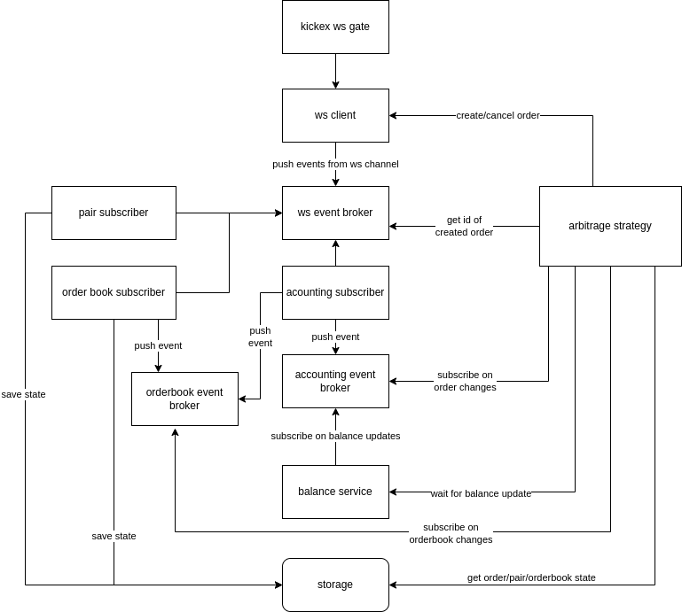

Trading bot for [kickex](https://kickex.com/) exchange

Implemented 3 strategies:

* buy
* spread
* arbitrage

## Project installation

* [Download](https://www.docker.com/get-started) and install docker
* Copy ./conf/conf.example.json to ./conf/conf.remote.json and edit it

### To run in docker swarm 

* Review ./docker-compose-swarm.yml and enable/disable required strategies
* Run `docker swarm init`
* Run `make deploy_swarm`

### To run in k8s with helm

* helm install -n=prod arbitrage-kickbtc helm/arbitrage --wait --dry-run
* helm install -n=prod buy-kickusdt helm/buy --wait --dry-run
* helm install -n=prod spread-kickusdt helm/spread --wait --dry-run

#### Arbitrage bot architecture

### Linters

    make lint

### Tests

    make test
